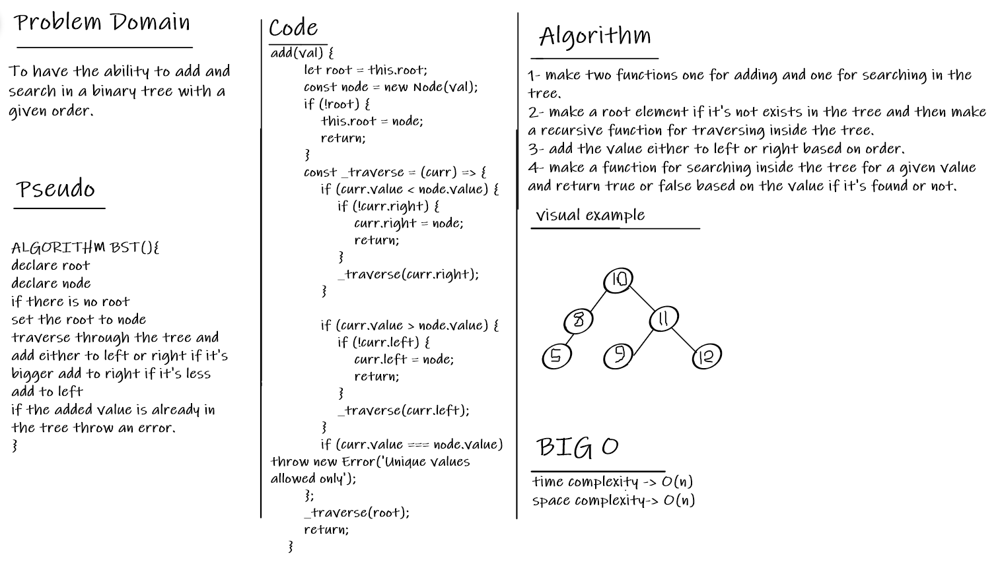

# BST

 a binary search tree, also called an ordered or sorted binary tree, is a rooted binary tree whose internal nodes each store a key greater than all the keys in the node's left subtree and less than those in its right subtree.

## The Challenge

To have the ability to add and search in a binary tree with a given order.

## Whiteboard

  

## API

1. add: adds new node to the tree
1. contains: search for a certain value in the tree and return true or false based on it.
