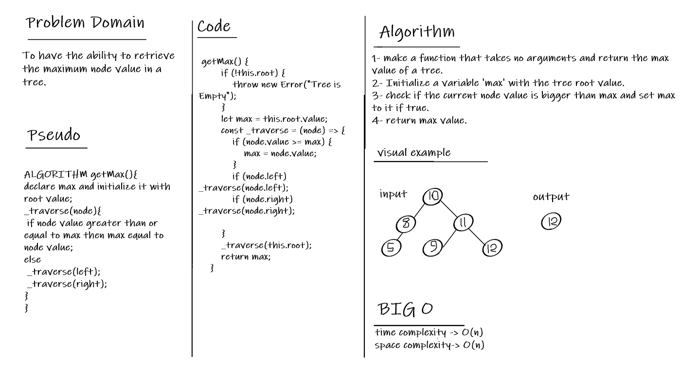

# BT Max

Find the Maximum Value in a Binary Tree

## The challenge

To have the ability to retrieve the maximum node value in a tree.

## Whiteboard

## API

**getMax**: return the max value inside the tree.