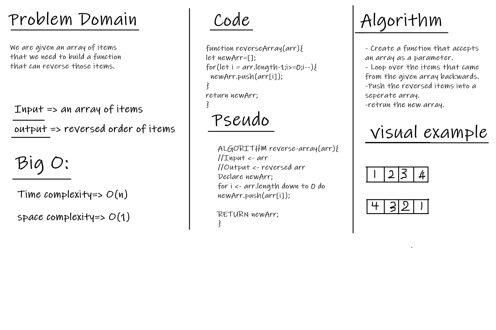

# Reverse an Array

The function recieves an array then it reverse the array elements using backward for loop.

## Whiteboard Process

## Approach & Efficiency

I took the backwards loop aproach because it makes sense for me and I think it's the simplest way to implement this challenge.
