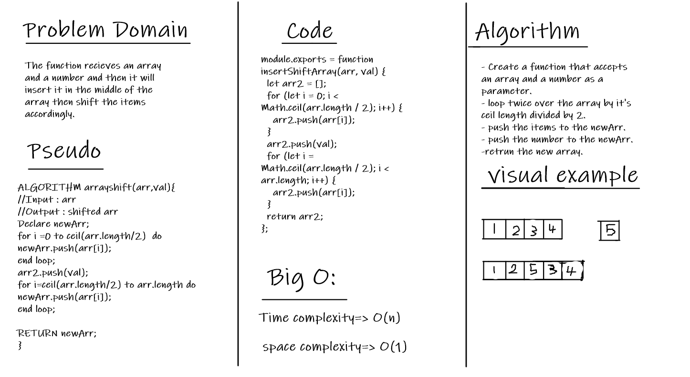

# Reverse an Array

The function recieves an sorted array and a number and then it will insert it in the middle of the array then shift the items accordingly.

## Whiteboard Process

## Approach & Efficiency

I took the approach of taking the middle index then using loop over the array with a condition that push numbers from the first array as well as the given number into the new array at proper index.
