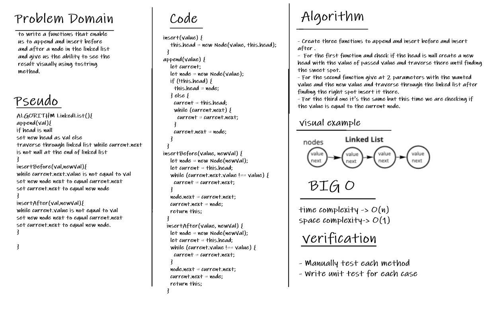

# Linked Lists Insertions

it's a sequence of nodes that are connected togather, each node points to it's next neighbor
until the end (tail) where it will points to nothing (null).

## The challenge

The challenge was the ability to implement our own linked list and append to it and insertBefore and insertAfter it and the ability to test it.

## The Whiteboard

## API

**insert**: inserting on the head of the linked list.

**append**: appending over to the end of the linked list.

**includes**: searching for a specific value and check if it's there.

**toString**: to represent our linked list in a readable form as a Javascript object litterals.

**insertBefore**: insert before a certain value.

**insrtAfter**: insert after a certain value.
