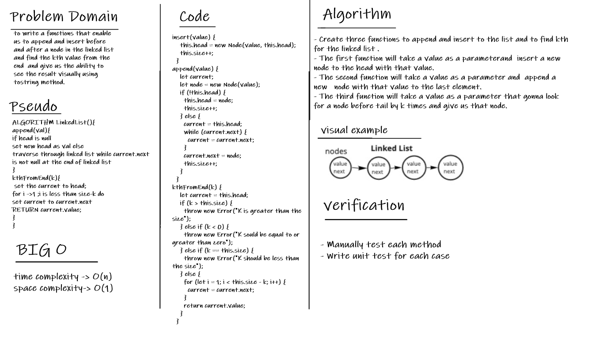

# Linked List Kth From End

it's a sequence of nodes that are connected togather, each node points to it's next neighbor
until the end (tail) where it will points to nothing (null).

## The Challenge

The challenge was the ability to traverse through the linked list from end by k times and get the node that was before it.

## Whiteboard

## API

**insert**: inserting on the head of the linked list.

**append**: appending over to the end of the linked list.

**KthFromEnd**: searching for a specific value before the tail by k times.

**toString**: to represent our linked list in a readable form as a Javascript object litterals.
