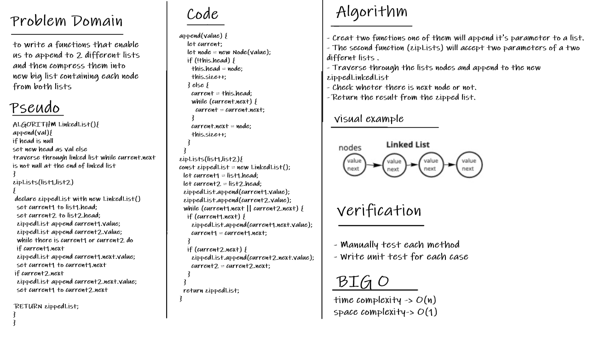

# Linked Lists Zip

**compress two linked list into one linked list.**

## The Challenge

**to write a functions that enable us to append to 2 different lists and then compress them into new big list containing each node from both lists.**

## The Whiteboard

## API

**append**: appending over to the end of the linked list.

**zipLists**: Making a new Linked List from existing two linked Lists.
