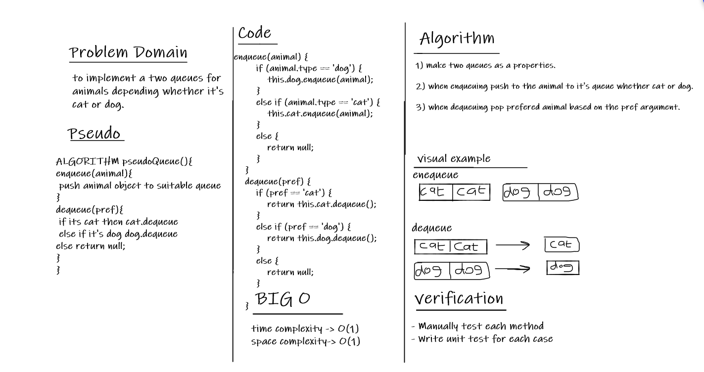

# Stacks and Queues

Queue: A Queue is a linear structure which follows a particular order in which the operations are performed. The order is First In First Out (FIFO).

## Challenge

To Implement the Animal shelter using queues data stractures.

## Whiteboard

## Approach & Efficiency

I took the approach of implementing the challenge using queues list as required.

for **big O:**

both of them have a time complexity O(n) and a space complexity O(1) because both of them works linearly.

## API

**Shelter:**

- enqueue(animal): add Items to the queue.
- dequeue(pref): remove Items from the queue based on an argument.
