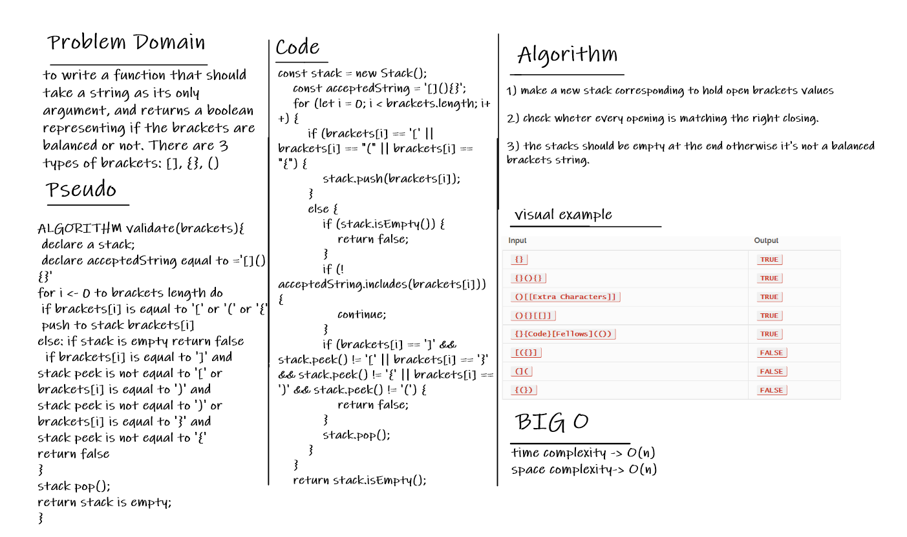

# Multi-bracket Validation

To write a function that should take a string as its only argument, and returns a boolean representing if the brackets are balanced or not. There are 3 types of brackets: [], {}, ()

## WhiteBoard 

## Big O

This algorithm has big O(n) for each space and time complexity because of the linear nature of it.

## API:

- validateBrackets(brackets): will return true or false based on combinations matching between brackets