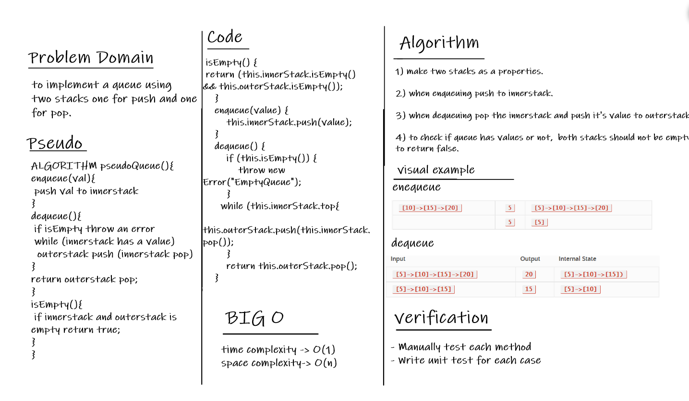

# Stacks and Queues

Queue: A Queue is a linear structure which follows a particular order in which the operations are performed. The order is First In First Out (FIFO).

## Challenge

To Implement a queue using two stacks.

## Whiteboard 

## Approach & Efficiency

I took the approach of implementing the queue using two stacks as required.

for **big O:**

it has a time complexity O(1) and a space complexity O(n).

## API

**Queue:**

- enqueue: add Items to the queue.
- dequeue: remove Items from the queue.
- isEmpty: check wheter the queue is empty or not.
